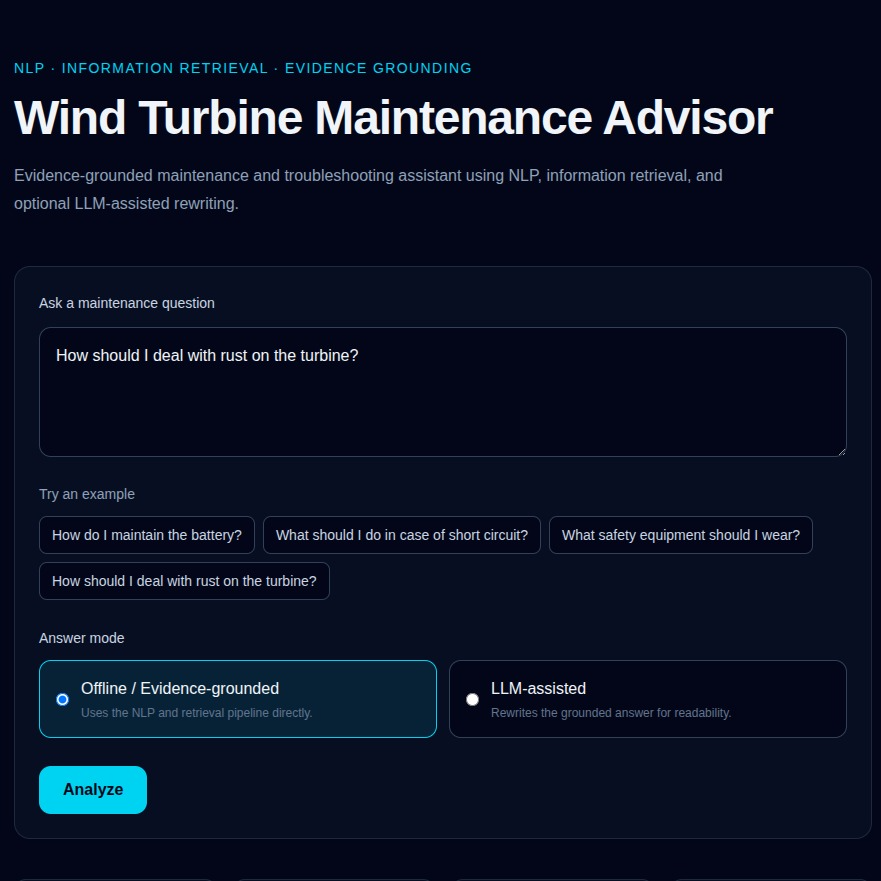
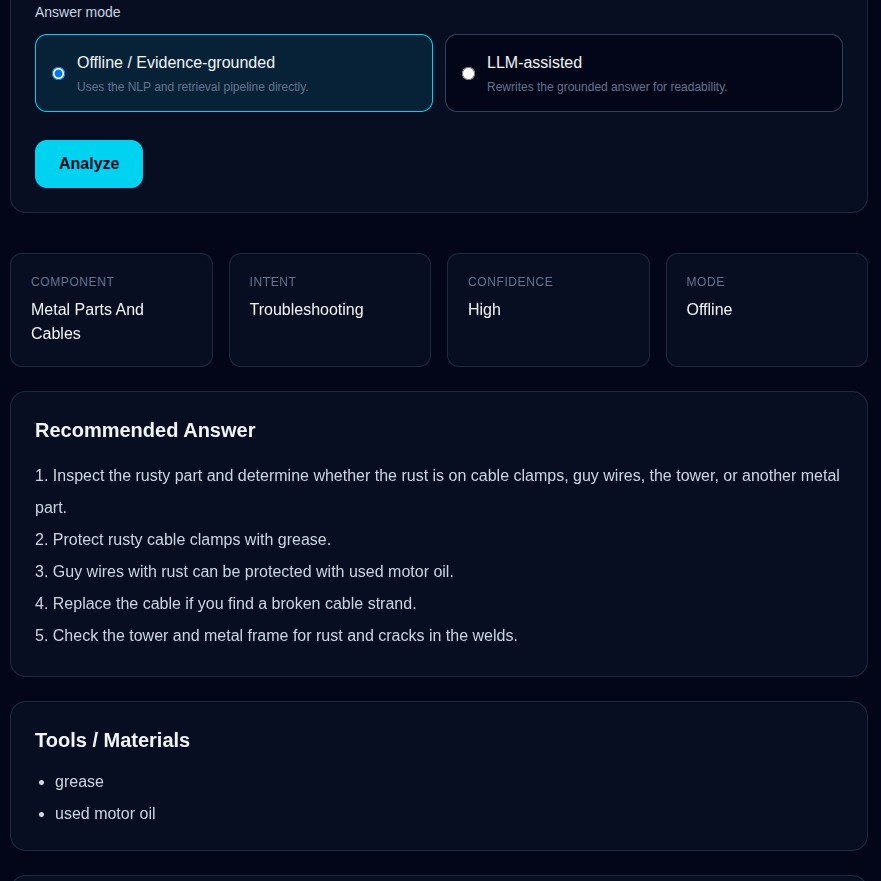
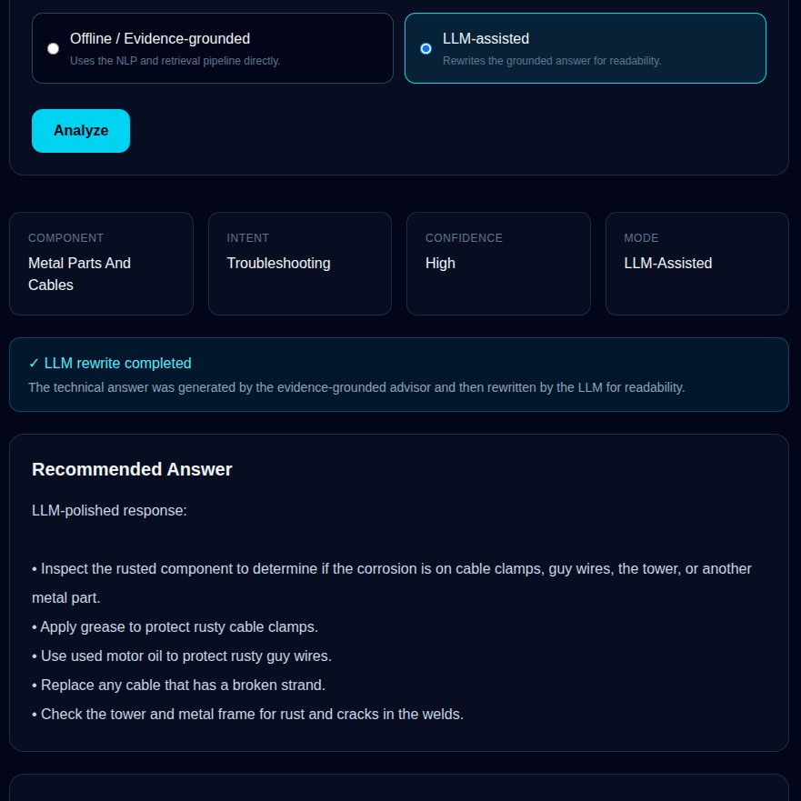

# Wind Turbine Maintenance Advisor

A full-stack, evidence-grounded wind turbine maintenance and troubleshooting assistant built with **NLP, Information Retrieval, FastAPI, Next.js, and optional LLM-assisted rewriting**.

## Live Demo

**Application:**  
https://wind-turbine-maintenance-advisor.vercel.app

The deployed application supports:

- Offline / Evidence-grounded mode
- LLM-assisted rewriting mode using Groq
- FastAPI backend
- Next.js frontend
- Supporting evidence from the maintenance manual

---

## Screenshots

### Advisor Interface



### Offline / Evidence-Grounded Result



### LLM-Assisted Result



---

## Overview

This project is an **evidence-grounded Wind Turbine Operation and Maintenance Advisor** based on a technical maintenance manual.

The system combines:

- Natural Language Processing
- Information Retrieval
- Structured maintenance knowledge
- Rule-based reasoning
- FastAPI
- Next.js
- Optional LLM-assisted rewriting

The application supports two answer modes:

### Offline / Evidence-Grounded

The offline advisor is the main technical system.

It:

1. Detects the user's intent
2. Detects the relevant wind turbine component
3. Retrieves relevant manual sections using TF-IDF
4. Ranks evidence using cosine similarity
5. Uses structured maintenance knowledge
6. Generates a grounded answer
7. Returns tools, safety information, confidence, and supporting evidence

No external LLM is required for this mode.

### LLM-Assisted

The system first generates the same grounded technical answer using the offline advisor.

The answer is then sent to an LLM through the **Groq API** only to improve wording and presentation.

The LLM does **not independently generate the maintenance recommendation**.

---

## Main Features

- TF-IDF document retrieval
- Cosine similarity ranking
- Rule-based intent detection
- Rule-based component detection
- Structured JSON knowledge base
- Evidence-grounded answers
- Confidence estimation
- Tool and material extraction
- Safety information
- Manual evidence display
- Optional Groq LLM rewriting
- Automatic offline fallback if the LLM is unavailable
- FastAPI REST API
- Next.js / React frontend
- TypeScript
- Tailwind CSS
- Full-stack Vercel deployment

---

## Architecture

```text
User
  |
  v
Next.js Frontend
  |
  v
FastAPI REST API
  |
  v
Offline Maintenance Advisor
  |
  |-- Intent Detection
  |-- Component Detection
  |-- TF-IDF Retrieval
  |-- Cosine Similarity Ranking
  |-- Structured Knowledge Base
  |-- Tool / Safety Extraction
  `-- Evidence-Grounded Answer
              |
              +------------------------+
              |                        |
              | Offline Mode           | LLM-Assisted Mode
              |                        |
              v                        v
         Final Answer            Groq LLM Rewrite
                                         |
                                         v
                                    Final Answer
```

The important design principle is:

```text
Maintenance Manual
        |
        v
Information Retrieval
        |
        v
Grounded Technical Answer
        |
        v
Optional LLM Presentation Layer
```

The LLM is not the source of the maintenance knowledge.

---

## How the Offline Advisor Works

### 1. Intent Detection

The system identifies the purpose of the question, such as:

- Maintenance
- Troubleshooting
- Safety
- Inspection
- General operation

### 2. Component Detection

The advisor determines which wind turbine component the user is asking about.

Examples include:

- Battery
- Blades
- Tower
- Generator
- Electrical system
- Controller
- Metal parts and cables

### 3. TF-IDF Retrieval

The technical maintenance manual is divided into searchable chunks.

The query and manual chunks are represented using **TF-IDF vectors**.

### 4. Cosine Similarity

Cosine similarity is used to rank the manual chunks according to their relevance to the user's question.

The highest-ranked chunks are returned as supporting evidence.

### 5. Structured Maintenance Knowledge

The advisor also uses a structured JSON knowledge base containing information such as:

- Maintenance actions
- Troubleshooting actions
- Tools and materials
- Safety information
- Component-specific recommendations

### 6. Evidence-Grounded Response

The final offline response includes:

- Detected component
- Detected intent
- Confidence level
- Recommended answer
- Tools / materials
- Safety warnings
- Supporting evidence
- Similarity scores

---

## Offline vs LLM-Assisted Example

### Offline Response

```text
1. Inspect the rusty part and determine whether the rust is on
   cable clamps, guy wires, the tower, or another metal part.

2. Protect rusty cable clamps with grease.

3. Guy wires with rust can be protected with used motor oil.

4. Replace the cable if you find a broken cable strand.

5. Check the tower and metal frame for rust and cracks in the welds.
```

### LLM-Assisted Response

```text
LLM-polished response:

• Inspect the rusty part to determine whether the corrosion is on
  cable clamps, guy wires, the tower, or another metal component.

• Protect rusty cable clamps with grease.

• Use used motor oil to protect rusted guy wires.

• Replace the cable if a broken strand is found.

• Check the tower and metal frame for rust and cracks in the welds.
```

The technical meaning remains grounded in the offline advisor.

---

## LLM Integration

The project uses the **Groq API** with:

```text
openai/gpt-oss-20b
```

The LLM is instructed to:

- Preserve the technical meaning
- Improve readability
- Change presentation
- Avoid adding unsupported maintenance instructions
- Avoid adding new tools
- Avoid adding new safety information
- Avoid independently answering the original question

If the Groq request fails, the system automatically returns the offline answer.

---

## API

The backend is implemented using **FastAPI**.

### Health Check

```http
GET /health
```

Production endpoint:

```text
https://wind-turbine-maintenance-advisor.vercel.app/health
```

Example response:

```json
{
  "status": "ok"
}
```

### Advisor Endpoint

```http
POST /api/advisor
```

Example request:

```json
{
  "question": "How do I maintain the battery?",
  "mode": "offline"
}
```

Available modes:

```text
offline
llm
```

Example response:

```json
{
  "question": "How do I maintain the battery?",
  "intent": "maintenance",
  "component": "battery",
  "confidence": "medium",
  "answer": "Generated maintenance answer",
  "tools_materials": ["clamp meter"],
  "safety_topics": ["electrical"],
  "safety_warnings": [],
  "evidence": [],
  "answer_mode": "offline_advisor"
}
```

---

## Project Structure

```text
wind-turbine-maintenance-advisor/
|
|-- backend/
|   `-- main.py
|
|-- data/
|   |-- chunks.json
|   `-- knowledge_base.json
|
|-- docs/
|   `-- screenshots/
|       |-- 01-advisor-interface.png
|       |-- 02-offline-evidence-grounded-result.png
|       `-- 03-llm-assisted-result.png
|
|-- frontend/
|   |-- public/
|   |-- src/
|   |   `-- app/
|   |       `-- page.tsx
|   |-- package.json
|   `-- ...
|
|-- reports/
|
|-- src/
|   |-- __init__.py
|   |-- advisor.py
|   |-- app.py
|   `-- llm_answer.py
|
|-- tests/
|
|-- .gitignore
|-- pytest.ini
|-- README.md
|-- requirements.txt
`-- vercel.json
```

---

## Running Locally

### 1. Clone the Repository

```bash
git clone https://github.com/abhinabadutta2019/wind-turbine-maintenance-advisor.git
```

```bash
cd wind-turbine-maintenance-advisor
```

### 2. Create a Python Virtual Environment

```bash
python3 -m venv venv
```

Activate it:

```bash
source venv/bin/activate
```

### 3. Install Backend Dependencies

```bash
pip install -r requirements.txt
```

### 4. Configure Groq

LLM-assisted mode requires a Groq API key.

Create a `.env` file in the project root:

```env
GROQ_API_KEY=your_groq_api_key
```

Do not commit the `.env` file.

Offline mode works without Groq.

### 5. Run the FastAPI Backend

```bash
uvicorn backend.main:app --reload
```

Backend:

```text
http://127.0.0.1:8000
```

Health check:

```text
http://127.0.0.1:8000/health
```

FastAPI documentation:

```text
http://127.0.0.1:8000/docs
```

### 6. Configure the Frontend

Create:

```text
frontend/.env.local
```

Add:

```env
NEXT_PUBLIC_API_URL=http://127.0.0.1:8000
```

### 7. Run the Frontend

```bash
cd frontend
npm install
npm run dev
```

Frontend:

```text
http://localhost:3000
```

---

## CLI Usage

The original command-line interface is also available.

### Offline

```bash
python src/app.py "How do I maintain the battery?"
```

### LLM-Assisted

```bash
python src/app.py "How do I maintain the battery?" --use-llm
```

---

## Example Questions

```text
How do I maintain the battery?
```

```text
What should I do in case of short circuit?
```

```text
What safety equipment should I wear?
```

```text
How should I deal with rust on the turbine?
```

---

## Technologies

### NLP / Information Retrieval

- TF-IDF
- Cosine Similarity
- Rule-based intent detection
- Rule-based component detection
- Structured JSON knowledge base

### Backend

- Python
- FastAPI
- Uvicorn
- scikit-learn

### LLM

- Groq API
- GPT-OSS 20B

### Frontend

- Next.js
- React
- TypeScript
- Tailwind CSS

### Deployment

- Vercel
- Vercel Services
- GitHub

---

## Deployment

The application is deployed as a full-stack Vercel project.

```text
Vercel
|
|-- Next.js Frontend
|
`-- FastAPI Backend
      |
      |-- NLP / IR pipeline
      |-- Structured knowledge base
      `-- Groq integration
```

Production URL:

https://wind-turbine-maintenance-advisor.vercel.app

The `/api/*` routes are routed to the FastAPI service while the frontend is served by Next.js.

---

## Design Principles

- The offline advisor remains the technical source of truth
- Maintenance recommendations are grounded in retrieved manual content
- Evidence is exposed to the user
- The LLM is used as a controlled rewriting layer
- The project continues working when the LLM service is unavailable
- API keys are excluded from version control
- Frontend and backend are separated cleanly
- The application can be used through both a web interface and CLI

---

## Current Status

The project currently includes:

- Working NLP/IR maintenance advisor
- TF-IDF retrieval
- Cosine similarity ranking
- Rule-based component detection
- Rule-based intent detection
- Structured maintenance knowledge
- Confidence estimation
- Tool / material extraction
- Safety information
- Supporting evidence
- FastAPI REST API
- Next.js frontend
- Offline mode
- LLM-assisted mode
- Groq integration
- Automatic LLM fallback
- Production deployment on Vercel

---

## Future Improvements

Possible extensions include:

- Improved intent classification
- Improved component classification
- Retrieval evaluation metrics
- Evaluation on a larger maintenance-question dataset
- Improved manual preprocessing
- Support for additional wind turbine manuals
- More structured maintenance rules
- Expanded automated testing
- Docker support

---

## Author

**Abhinaba Dutta**

MSc in Data, Algorithms and Machine Intelligence  
University of Palermo, Italy

GitHub: [abhinabadutta2019](https://github.com/abhinabadutta2019)
